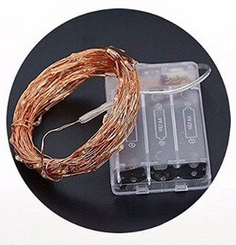
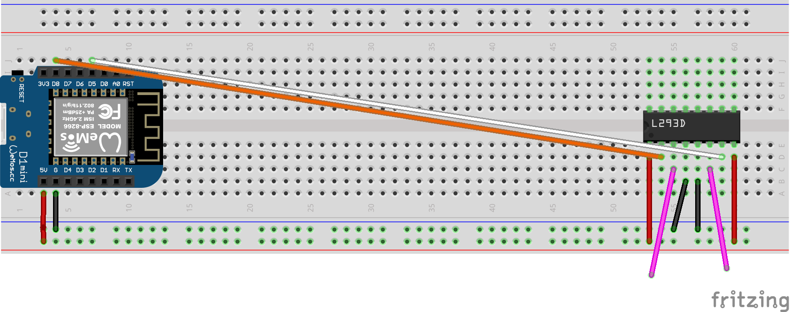

HTTP Control of copper wire lights
----------------------------------

Control copper wire lights over WiFi with an ESP8266.


What this does
--------------

It' allows you to control a string of copper wire
lights over an http API. You can switch them on, off and rotate through a number of patterns 
(constant on, flashing fast, flashing slow, fading slow, fadingslow, off).

And because we're now API driven you can hook it your lights up to Home Assistant,
node-red or a home automation platform of your choice.


How copper wire lights works
----------------------------



They're a series of LEDs on a copper wire. The D in LED stands for Diode, and a diode
only lets current flow in one direction. The LEDs in these lights are wired up in
alternating directions so that 50% of them light up when electricty flows one way,
50% of them when it flows in the other direction. 

We can use an L923D circuit to switch the polarity of the voltage that we apply to
the copper lights. These circuits (also known as H or half-H bridges) are 
commonly used to drive motors - applying current in one polarity drives the
motor in one direction, switching the polarity drives the motor in another.

We're just using the polarity switch to turn on one set of LEDs or the other,
and a principle called Pulse Width Modulation (pwm) to set the brightness of the
selected LEDs.


How to build
------------

You'll need
- 1 x Wemos D1 mini (or similar)
- 1 x L923D motor driver switch
- 1 x Breadboard
- 1 x Bunch of jumper wires
- 1 x string of copper lights

This is a fairly straightforward breadboard build for anyone who has already put
together a few breadboarded circuits with an Arduino, ESP8266 or similar.

1. Build the circuit as per the diagram below. Pay close attention to the connections
between the L923D and Wemos D1 mini.
2. You will have two wires that remain unconnected. These will provide power to
the lights. These are the pink wires in the diagram below.
3. Cut the battery box from lights, fairly close to the battery box so you have
plenty of wire remaining.
4. Strip off some of the wire attached to the lights that was previously attached
to the battery box
5. Connect one of the wires you just stripped to one of the unconnected wires
on the L923D. It doesn't matter which.
6. Connect the remaining wire to the remaining wire on the L923D.
7. Copy the file ./secrets.h.EXAMPLE to secrets.h and edit it so that it contains
your Wifi SSID and password
7. Compile and upload the code contained in http2copper-wire-lights.ino
8. Start up a serial monitor and hit the reset button on the Wemos D1 mini. After
it's connected to your wifi it will report it's IP address. 
9. You can use the IP address to connect to the API using your browser. eg if
the reported IP adress is 192.168.0.100 you can visit http://192.168.0.10/next
to cycle though the light's patterns.



How to use
----------

After starting up the lights will be in 'constant on' mode. You can then use the API

The API has the following endpoints

```
/next - change the lights to display the next pattern in the sequence
/random - display a random pattern (excluding 'off')
/off - turn the lights off
```

The response will always be a json payload describing the pattern.


License and liability
---------------------

All code, instructions, diagrams released under MIT License. 
